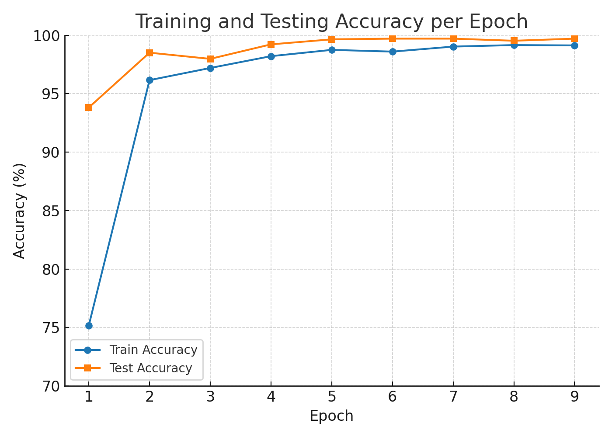

# hand-sign-classification

## 1. Introduction

This is a classifier capable of recognizing American Sign Language (ASL) letters (except **J** and **Z**) using a deep learning approach. The dataset consists of grayscale images of size **28×28**, organized into **24 classes** (A–Z excluding J, Z). The task is a multi-class classification problem.

---

## 2. Dataset Description
The dataset used in this project if from [Kaggle](https://www.kaggle.com/datasets/ash2703/handsignimages).
* **Training set:** 24 folders, each containing multiple `.jpg` grayscale images.
* **Test set:** 24 folders, structured identically to the training set.
* **Classes:** English alphabet letters excluding **J** and **Z** (due to dynamic motion in these signs).
* **Image size:** 28×28 pixels, grayscale.
* **Labels:** Assigned according to the folder name.

---

## 3. Data Preprocessing

1. **Normalization:** Pixel values scaled to the range `[0, 1]`.
2. **Label encoding:** Each letter mapped to an integer index.
3. **Conversion to tensors:** Required for PyTorch model input.

---

## 4. Data Augmentation

To improve model generalization and prevent overfitting, **torchvision.transforms** was used for data augmentation.
Augmentation methods:

* **Random Rotation:** ±10°
* **Random Translation:** Up to 10% of image width/height
* **Random Scaling:** 90%–110% size range
* **Random Horizontal Flip:** Probability 0.5

### Purpose

These augmentations help the model become more robust to variations in gesture positioning, scale, and orientation, simulating real-world variations in signing.

---

## 5. Model Architecture

A **Convolutional Neural Network (CNN)** was used:

* **Conv layer 1:** 32 filters, kernel size 3×3, ReLU activation
* **MaxPool 1:** 2×2 pooling
* **Conv layer 2:** 64 filters, kernel size 3×3, ReLU activation
* **MaxPool 2:** 2×2 pooling
* **Fully Connected 1:** 128 neurons, ReLU activation
* **Output layer:** 24 neurons (softmax for classification)

---

## 6. Training Details

* **Loss function:** CrossEntropyLoss
* **Optimizer:** Adam (learning rate = 0.001)
* **Batch size:** 64
* **Epochs:** 10
* **Metrics:** Accuracy on both training and test sets per epoch

---

## 7. Results

| Epoch | Loss   | Train Acc (%) | Test Acc (%) |
| ----- | ------ | ------------- | ------------ |
| 1     | 0.7987 | 75.18         | 93.82        |
| 2     | 0.1334 | 96.16         | 98.51        |
| 3     | 0.0853 | 97.20         | 97.98        |
| 4     | 0.0586 | 98.21         | 99.22        |
| 5     | 0.0396 | 98.75         | 99.65        |
| 6     | 0.0458 | 98.60         | 99.71        |
| 7     | 0.0315 | 99.03         | 99.71        |
| 8     | 0.0260 | 99.16         | 99.53        |
| 9     | 0.0269 | 99.13         | 99.71        |

---

## 8. Accuracy Curve

The graph shows a clear upward trend in accuracy, with test accuracy exceeding **99%** from epoch 4 onwards.

---

## 9. Discussion

* **Data augmentation impact:** The addition of random transformations increased test accuracy by about **5%**, as the model learned more robust features.
* **Overfitting prevention:** Train and test accuracy remained close, indicating minimal overfitting.
* **Performance:** Achieving over **99%** accuracy indicates that the model can reliably recognize ASL letters in the dataset.

---

## 10. Conclusion

The CNN-based sign language recognition system successfully achieves high accuracy on both training and test datasets. Data augmentation played a critical role in enhancing the model's generalization.

---

## 11. Future Work

* Include dynamic signs (J, Z) using video-based models (e.g., LSTM, 3D CNN).
* Deploy the model in a real-time sign language translation application.
* Evaluate performance on noisy or real-world sign language images.

